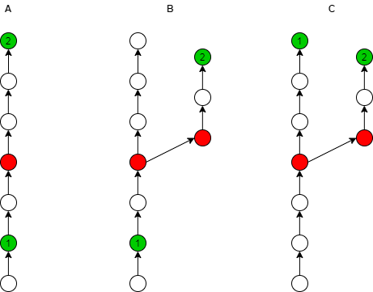

<div align="center">

# 📋 diffmanifests

**A powerful tool for deep manifest comparison via Gerrit & Gitiles API**

[English](README.md) | [简体中文](README_cn.md)

[](https://pypi.org/project/diffmanifests/)
[](https://coveralls.io/github/craftslab/diffmanifests?branch=master)
[](https://github.com/craftslab/diffmanifests/blob/master/LICENSE)
[](https://www.python.org/downloads/)

</div>

---

## 🌟 Overview

**diffmanifests** is a sophisticated CLI tool designed to reveal deeper differences between manifest files by leveraging the Gerrit and Gitiles APIs. It provides comprehensive change tracking, hashtag support, and detailed commit analysis for efficient manifest version management.

### ✨ Key Highlights

- 🔍 **Deep Comparison**: Analyze differences between manifest versions with precision
- 🏷️ **Hashtag Integration**: Full support for Gerrit hashtags and categorization
- 📊 **Visual Reporting**: Generate detailed JSON reports with comprehensive commit information
- 🔄 **API-Powered**: Seamlessly integrates with Gerrit and Gitiles REST APIs
- ⚡ **Easy to Use**: Simple command-line interface with clear configuration

---

## 📋 Table of Contents

- [Requirements](#-requirements)
- [Installation](#-installation)
- [Quick Start](#-quick-start)
- [Configuration](#-configuration)
- [Features](#-features)
- [Output Format](#-output-format)
- [Examples](#-examples)
- [Development](#-development)
- [License](#-license)
- [References](#-references)

---

## 🔧 Requirements

- **Python**: >= 3.7
- **Dependencies**:
  - `colorama` - Terminal color output
  - `openpyxl` - Excel file handling
  - `requests` - HTTP library
  - `xmltodict` - XML parsing

---

## 📦 Installation

### Install from PyPI

```bash
pip install diffmanifests
```

### Upgrade to Latest Version

```bash
pip install diffmanifests --upgrade
```

### Install from Source

```bash
git clone https://github.com/craftslab/diffmanifests.git
cd diffmanifests
pip install -e .
```

---

## 🚀 Quick Start

### Basic Usage

```bash
diffmanifests \
  --config-file config.json \
  --manifest1-file manifest1.xml \
  --manifest2-file manifest2.xml \
  --output-file output.json
```

### Command Line Arguments

| Argument | Description | Required |
|----------|-------------|----------|
| `--config-file` | Path to configuration JSON file | ✅ |
| `--manifest1-file` | Path to first manifest XML file (older version) | ✅ |
| `--manifest2-file` | Path to second manifest XML file (newer version) | ✅ |
| `--output-file` | Path to output file for results (supports `.json`, `.txt`, `.xlsx` formats) | ✅ |

---

## ⚙️ Configuration

Configuration parameters can be set in a JSON file. See the [config directory](https://github.com/craftslab/diffmanifests/blob/master/diffmanifests/config) for examples.

### Configuration Structure

Create a `config.json` file with the following structure:

```json
{
  "gerrit": {
    "url": "https://your-gerrit-instance.com",
    "user": "your-username",
    "pass": "your-password-or-token"
  },
  "gitiles": {
    "url": "https://your-gitiles-instance.com",
    "user": "your-username",
    "pass": "your-password-or-token",
    "retry": 3,
    "timeout": 30
  }
}
```

### Configuration Parameters

#### Gerrit Settings

| Parameter | Type | Description |
|-----------|------|-------------|
| `url` | string | Gerrit instance URL |
| `user` | string | Authentication username |
| `pass` | string | Authentication password or API token |

#### Gitiles Settings

| Parameter | Type | Description | Default |
|-----------|------|-------------|---------|
| `url` | string | Gitiles instance URL | - |
| `user` | string | Authentication username | - |
| `pass` | string | Authentication password or API token | - |
| `retry` | integer | Number of retry attempts for failed requests | 1 |
| `timeout` | integer | Request timeout in seconds (-1 for no timeout) | -1 |

---

## 🎯 Features

### 📊 Manifest Comparison

Compare two manifest versions to identify changes between commits. The tool analyzes differences using a three-way comparison model:



**Comparison Logic**:
- **Diagram A**: Changes from commit 1 to commit 2
- **Diagram B**: Alternative change paths
- **Diagram C**: Merge scenarios

### 🏷️ Hashtag Support

Comprehensive support for Gerrit hashtags through REST API v3.12.1, enabling better change tracking and categorization.

#### Key Benefits

✅ **Automatic hashtag extraction** from Gerrit changes  
✅ **Enhanced categorization** and filtering capabilities  
✅ **Seamless Gerrit workflow** integration  
✅ **Graceful fallback** for changes without hashtags  

#### Use Cases

| Hashtags | Use Case |
|----------|----------|
| `["feature", "ui", "enhancement"]` | New UI features |
| `["bugfix", "critical"]` | Critical bug fixes |
| `["security", "cve"]` | Security-related changes |
| `["refactor", "cleanup"]` | Code refactoring |
| `[]` | Changes without hashtags |

---

## 📄 Output Format

The tool supports three output formats determined by the file extension:

- **`.json`** - Structured JSON format for programmatic processing
- **`.txt`** - Human-readable plain text format
- **`.xlsx`** - Excel spreadsheet format for analysis and reporting

### JSON Output Structure

```json
{
  "author": "Developer Name <dev@example.com>",
  "branch": "master",
  "change": "https://gerrit.example.com/c/12345",
  "commit": "abc123def456789...",
  "committer": "Developer Name <dev@example.com>",
  "date": "2025-08-20 12:00:00 +0000",
  "diff": "ADD COMMIT",
  "hashtags": ["security", "cve", "bugfix"],
  "message": "Fix security vulnerability CVE-2025-1234",
  "repo": "platform/frameworks/base",
  "topic": "security-fix",
  "url": "https://android.googlesource.com/platform/frameworks/base/+/abc123def456789"
}
```

### Output Fields

| Field | Type | Description |
|-------|------|-------------|
| `author` | string | Original commit author |
| `branch` | string | Target branch name |
| `change` | string | Gerrit change URL |
| `commit` | string | Git commit SHA |
| `committer` | string | Person who committed the change |
| `date` | string | Commit timestamp |
| `diff` | string | Type of change (ADD COMMIT, REMOVE COMMIT, etc.) |
| `hashtags` | array | List of associated hashtags |
| `message` | string | Commit message |
| `repo` | string | Repository path |
| `topic` | string | Gerrit topic name |
| `url` | string | Gitiles commit URL |

---

## 💡 Examples

### Example 1: Basic Comparison (JSON Output)

```bash
diffmanifests \
  --config-file ./config/config.json \
  --manifest1-file ./data/android-11.xml \
  --manifest2-file ./data/android-12.xml \
  --output-file ./results/diff-output.json
```

**Alternative Output Formats:**

```bash
# Plain text format
diffmanifests \
  --config-file ./config/config.json \
  --manifest1-file ./data/android-11.xml \
  --manifest2-file ./data/android-12.xml \
  --output-file ./results/diff-output.txt

# Excel format
diffmanifests \
  --config-file ./config/config.json \
  --manifest1-file ./data/android-11.xml \
  --manifest2-file ./data/android-12.xml \
  --output-file ./results/diff-output.xlsx
```

### Example 2: With Custom Configuration

```bash
# config.json
{
  "gerrit": {
    "url": "https://android-review.googlesource.com",
    "user": "developer",
    "pass": "your-token"
  },
  "gitiles": {
    "url": "https://android.googlesource.com",
    "user": "developer",
    "pass": "your-token",
    "retry": 5,
    "timeout": 60
  }
}

# Run comparison
diffmanifests \
  --config-file config.json \
  --manifest1-file old-manifest.xml \
  --manifest2-file new-manifest.xml \
  --output-file changes.json
```

### Example 3: Analyzing Output

```python
import json

# Load the output
with open('output.json', 'r') as f:
    changes = json.load(f)

# Filter security-related changes
security_changes = [
    c for c in changes
    if 'security' in c.get('hashtags', []) or 'cve' in c.get('hashtags', [])
]

print(f"Found {len(security_changes)} security-related changes")
```

---

## 🛠️ Development

### Setting Up Development Environment

```bash
# Clone the repository
git clone https://github.com/craftslab/diffmanifests.git
cd diffmanifests

# Install development dependencies
pip install -e .[dev]

# Run tests
pytest tests/

# Run tests with coverage
coverage run -m pytest tests/
coverage report
```

### Running Tests

```bash
# Run all tests
pytest

# Run specific test module
pytest tests/differ/test_differ.py

# Run with verbose output
pytest -v

# Run with coverage report
pytest --cov=diffmanifests tests/
```

### Project Scripts

Located in the `script/` directory:

- `clean.sh` - Clean build artifacts and cache files
- `dist.sh` - Build distribution packages
- `install.sh` - Install the package locally
- `run.sh` - Run the tool with test data
- `test.sh` - Execute test suite

---

## 📜 License

This project is licensed under the **Apache License 2.0**.

See [LICENSE](https://github.com/craftslab/diffmanifests/blob/master/LICENSE) for full details.

---

## 📚 References

- [Gerrit REST API Documentation](https://gerrit-documentation.storage.googleapis.com/Documentation/3.12.1/rest-api.html)
- [Gerrit ChangeInfo Entity](https://gerrit-documentation.storage.googleapis.com/Documentation/3.12.1/rest-api-changes.html#change-info)
- [git-repo/subcmds/diffmanifests](https://gerrit.googlesource.com/git-repo/+/master/subcmds/diffmanifests.py)
- [Gitiles API Documentation](https://gerrit.googlesource.com/gitiles/+/master/Documentation/design.md)

---

## 🤝 Contributing

Contributions are welcome! Please feel free to submit a Pull Request.

### How to Contribute

1. Fork the repository
2. Create your feature branch (`git checkout -b feature/amazing-feature`)
3. Commit your changes (`git commit -m 'Add some amazing feature'`)
4. Push to the branch (`git push origin feature/amazing-feature`)
5. Open a Pull Request

---

## 📞 Support

- **Issues**: [GitHub Issues](https://github.com/craftslab/diffmanifests/issues)
- **Email**: angersax@sina.com
- **PyPI**: [diffmanifests on PyPI](https://pypi.org/project/diffmanifests/)

---

<div align="center">

**Made with ❤️ by [craftslab](https://github.com/craftslab)**

⭐ Star this repository if you find it helpful!

</div>
