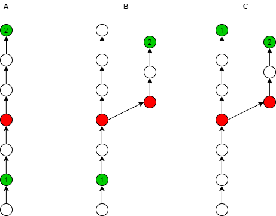

<div align="center">

# 📋 diffmanifests

**一个通过 Gerrit 和 Gitiles API 进行深度清单对比的强大工具**

[English](README.md) | [简体中文](README_cn.md)

[](https://pypi.org/project/diffmanifests/)
[](https://coveralls.io/github/craftslab/diffmanifests?branch=master)
[](https://github.com/craftslab/diffmanifests/blob/master/LICENSE)
[](https://www.python.org/downloads/)

</div>

---

## 🌟 概述

**diffmanifests** 是一个精密的命令行工具，旨在通过利用 Gerrit 和 Gitiles API 来揭示清单文件之间的深层差异。它为高效的清单版本管理提供全面的变更跟踪、标签支持和详细的提交分析。

### ✨ 核心亮点

- 🔍 **深度对比**：精确分析清单版本之间的差异
- 🏷️ **标签集成**：全面支持 Gerrit 标签和分类
- 📊 **可视化报告**：生成包含详细提交信息的 JSON 报告
- 🔄 **API 驱动**：与 Gerrit 和 Gitiles REST API 无缝集成
- ⚡ **易于使用**：简洁的命令行界面和清晰的配置
- 🎨 **VS Code 扩展**：[支持 Visual Studio Code](vscode/README_cn.md) 并集成 GUI 界面

---

## 📋 目录

- [系统要求](#-系统要求)
- [安装](#-安装)
- [VS Code 扩展](#-vs-code-扩展)
- [快速开始](#-快速开始)
- [配置](#-配置)
- [功能特性](#-功能特性)
- [输出格式](#-输出格式)
- [使用示例](#-使用示例)
- [开发](#-开发)
- [许可证](#-许可证)
- [参考资料](#-参考资料)

---

## 🔧 系统要求

- **Python**：>= 3.7
- **依赖库**：
  - `colorama` - 终端彩色输出
  - `openpyxl` - Excel 文件处理
  - `requests` - HTTP 库
  - `xmltodict` - XML 解析

---

## 📦 安装

### 从 PyPI 安装

```bash
pip install diffmanifests
```

### 升级到最新版本

```bash
pip install diffmanifests --upgrade
```

### 从源码安装

```bash
git clone https://github.com/craftslab/diffmanifests.git
cd diffmanifests
pip install -e .
```

---

## 🎨 VS Code 扩展

提供 **Visual Studio Code 扩展**，与您的 IDE 无缝集成！

### 功能特性

- 🖱️ **GUI 集成**：直接在 VS Code 中比较清单
- 📋 **侧边栏视图**：专用侧边栏，快速访问所有功能和设置
- ⚡ **快速操作**：从侧边栏比较清单、检查环境和管理设置
- 📂 **最近文件**：跟踪并快速访问最近比较的文件
- ⚙️ **自动配置**：自动检测 Python 环境
- 📊 **多种输出格式**：支持 JSON 和 Excel
- 🔄 **自动安装**：自动安装 diffmanifests 包
- 🌐 **跨平台**：支持 Windows、Ubuntu 和 macOS

### 快速链接

- 📖 **[VS Code 扩展文档](vscode/README_cn.md)** - 完整用户指南
- 🚀 **[安装指南](vscode/INSTALL.md)** - 平台特定说明
- ⚡ **[快速入门](vscode/QUICKSTART.md)** - 几分钟内开始使用

### 安装

```bash
# 进入扩展目录
cd vscode

# 安装依赖并构建
npm install
npm run compile

# 打包扩展
vsce package

# 在 VS Code 中安装
code --install-extension diffmanifests-1.0.0.vsix
```

有关详细安装说明，请参阅 [VS Code 扩展指南](vscode/README_cn.md)。

---

## 🚀 快速开始

### 基本用法

```bash
diffmanifests \
  --config-file config.json \
  --manifest1-file manifest1.xml \
  --manifest2-file manifest2.xml \
  --output-file output.json
```

### 命令行参数

| 参数 | 说明 | 必需 |
|----------|-------------|----------|
| `--config-file` | 配置 JSON 文件路径 | ✅ |
| `--manifest1-file` | 第一个清单 XML 文件路径（旧版本） | ✅ |
| `--manifest2-file` | 第二个清单 XML 文件路径（新版本） | ✅ |
| `--output-file` | 结果输出文件路径（支持 `.json`、`.txt`、`.xlsx` 格式） | ✅ |

---

## ⚙️ 配置

配置参数可以在 JSON 文件中设置。参见 [config 目录](https://github.com/craftslab/diffmanifests/blob/master/diffmanifests/config) 获取示例。

### 配置结构

创建一个包含以下结构的 `config.json` 文件：

```json
{
  "gerrit": {
    "url": "https://your-gerrit-instance.com",
    "user": "your-username",
    "pass": "your-password-or-token"
  },
  "gitiles": {
    "url": "https://your-gitiles-instance.com",
    "user": "your-username",
    "pass": "your-password-or-token",
    "retry": 3,
    "timeout": 30
  }
}
```

### 配置参数

#### Gerrit 设置

| 参数 | 类型 | 说明 |
|-----------|------|-------------|
| `url` | string | Gerrit 实例 URL |
| `user` | string | 认证用户名 |
| `pass` | string | 认证密码或 API 令牌 |

#### Gitiles 设置

| 参数 | 类型 | 说明 | 默认值 |
|-----------|------|-------------|---------|
| `url` | string | Gitiles 实例 URL | - |
| `user` | string | 认证用户名 | - |
| `pass` | string | 认证密码或 API 令牌 | - |
| `retry` | integer | 失败请求的重试次数 | 1 |
| `timeout` | integer | 请求超时时间（秒）（-1 表示无超时） | -1 |

---

## 🎯 功能特性

### 📊 清单对比

对比两个清单版本以识别提交之间的变更。该工具使用三向对比模型分析差异：

<div align="center">



</div>

**对比逻辑**：
- **图表 A**：从提交 1 到提交 2 的变更
- **图表 B**：替代变更路径
- **图表 C**：合并场景

### 🏷️ 标签支持

通过 REST API v3.12.1 全面支持 Gerrit 标签，实现更好的变更跟踪和分类。

#### 主要优势

✅ 从 Gerrit 变更中**自动提取标签**  
✅ 增强的**分类**和过滤功能  
✅ **无缝集成** Gerrit 工作流  
✅ 对无标签变更的**优雅降级**  

#### 使用场景

| 标签 | 使用场景 |
|----------|----------|
| `["feature", "ui", "enhancement"]` | 新增 UI 功能 |
| `["bugfix", "critical"]` | 关键错误修复 |
| `["security", "cve"]` | 安全相关变更 |
| `["refactor", "cleanup"]` | 代码重构 |
| `[]` | 无标签的变更 |

---

## 📄 输出格式

该工具支持三种输出格式,由文件扩展名决定：

- **`.json`** - 结构化 JSON 格式,便于程序处理
- **`.txt`** - 人类可读的纯文本格式
- **`.xlsx`** - Excel 电子表格格式,便于分析和报告

### JSON 输出结构

```json
{
  "author": "Developer Name <dev@example.com>",
  "branch": "master",
  "change": "https://gerrit.example.com/c/12345",
  "commit": "abc123def456789...",
  "committer": "Developer Name <dev@example.com>",
  "date": "2025-08-20 12:00:00 +0000",
  "diff": "ADD COMMIT",
  "hashtags": ["security", "cve", "bugfix"],
  "message": "Fix security vulnerability CVE-2025-1234",
  "repo": "platform/frameworks/base",
  "topic": "security-fix",
  "url": "https://android.googlesource.com/platform/frameworks/base/+/abc123def456789"
}
```

### 输出字段

| 字段 | 类型 | 说明 |
|-------|------|-------------|
| `author` | string | 原始提交作者 |
| `branch` | string | 目标分支名称 |
| `change` | string | Gerrit 变更 URL |
| `commit` | string | Git 提交 SHA |
| `committer` | string | 提交变更的人员 |
| `date` | string | 提交时间戳 |
| `diff` | string | 变更类型（ADD COMMIT、REMOVE COMMIT 等） |
| `hashtags` | array | 关联的标签列表 |
| `message` | string | 提交消息 |
| `repo` | string | 仓库路径 |
| `topic` | string | Gerrit 主题名称 |
| `url` | string | Gitiles 提交 URL |

---

## 💡 使用示例

### 示例 1：基本对比（JSON 输出）

```bash
diffmanifests \
  --config-file ./config/config.json \
  --manifest1-file ./data/android-11.xml \
  --manifest2-file ./data/android-12.xml \
  --output-file ./results/diff-output.json
```

**其他输出格式：**

```bash
# 纯文本格式
diffmanifests \
  --config-file ./config/config.json \
  --manifest1-file ./data/android-11.xml \
  --manifest2-file ./data/android-12.xml \
  --output-file ./results/diff-output.txt

# Excel 格式
diffmanifests \
  --config-file ./config/config.json \
  --manifest1-file ./data/android-11.xml \
  --manifest2-file ./data/android-12.xml \
  --output-file ./results/diff-output.xlsx
```

### 示例 2：自定义配置

```bash
# config.json
{
  "gerrit": {
    "url": "https://android-review.googlesource.com",
    "user": "developer",
    "pass": "your-token"
  },
  "gitiles": {
    "url": "https://android.googlesource.com",
    "user": "developer",
    "pass": "your-token",
    "retry": 5,
    "timeout": 60
  }
}

# 运行对比
diffmanifests \
  --config-file config.json \
  --manifest1-file old-manifest.xml \
  --manifest2-file new-manifest.xml \
  --output-file changes.json
```

### 示例 3：分析输出

```python
import json

# 加载输出
with open('output.json', 'r') as f:
    changes = json.load(f)

# 过滤安全相关变更
security_changes = [
    c for c in changes
    if 'security' in c.get('hashtags', []) or 'cve' in c.get('hashtags', [])
]

print(f"找到 {len(security_changes)} 个安全相关变更")
```

---

## 🛠️ 开发

### 设置开发环境

```bash
# 克隆仓库
git clone https://github.com/craftslab/diffmanifests.git
cd diffmanifests

# 安装开发依赖
pip install -e .[dev]

# 运行测试
pytest tests/

# 运行测试并生成覆盖率报告
coverage run -m pytest tests/
coverage report
```

### 运行测试

```bash
# 运行所有测试
pytest

# 运行特定测试模块
pytest tests/differ/test_differ.py

# 运行详细输出模式
pytest -v

# 运行并生成覆盖率报告
pytest --cov=diffmanifests tests/
```

### 项目脚本

位于 `script/` 目录：

- `clean.sh` - 清理构建产物和缓存文件
- `dist.sh` - 构建分发包
- `install.sh` - 本地安装包
- `run.sh` - 使用测试数据运行工具
- `test.sh` - 执行测试套件

---

## 📜 许可证

本项目采用 **Apache License 2.0** 许可证。

详见 [LICENSE](https://github.com/craftslab/diffmanifests/blob/master/LICENSE)。

---

## 📚 参考资料

- [Gerrit REST API 文档](https://gerrit-documentation.storage.googleapis.com/Documentation/3.12.1/rest-api.html)
- [Gerrit ChangeInfo 实体](https://gerrit-documentation.storage.googleapis.com/Documentation/3.12.1/rest-api-changes.html#change-info)
- [git-repo/subcmds/diffmanifests](https://gerrit.googlesource.com/git-repo/+/master/subcmds/diffmanifests.py)
- [Gitiles API 文档](https://gerrit.googlesource.com/gitiles/+/master/Documentation/design.md)

---

## 🤝 贡献

欢迎贡献！请随时提交 Pull Request。

### 如何贡献

1. Fork 本仓库
2. 创建您的特性分支 (`git checkout -b feature/amazing-feature`)
3. 提交您的变更 (`git commit -m 'Add some amazing feature'`)
4. 推送到分支 (`git push origin feature/amazing-feature`)
5. 开启一个 Pull Request

---

## 📞 支持

- **问题反馈**：[GitHub Issues](https://github.com/craftslab/diffmanifests/issues)
- **邮箱**：angersax@sina.com
- **PyPI**：[diffmanifests on PyPI](https://pypi.org/project/diffmanifests/)

---

<div align="center">

**用 ❤️ 制作，来自 [craftslab](https://github.com/craftslab)**

⭐ 如果觉得有帮助，请给个星标！

</div>
